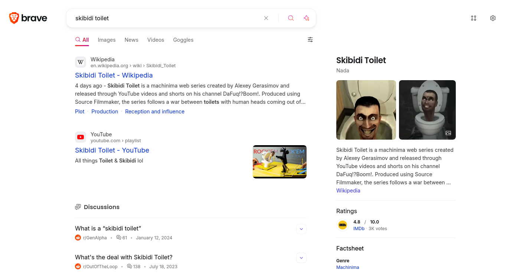
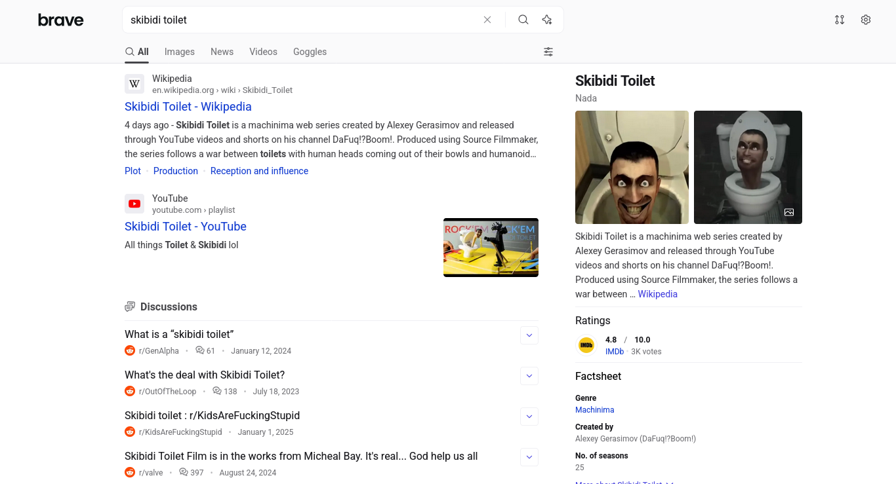

Brave, the search engine, is a pretty decent search engine that suffers with the same main issue that its also pretty decent relative Brave, the browser, does: it's ugly.

This userstyle makes Brave less brave / makes it less web3 slop looking.

Look at this! Isn't it just so much nicer? No ugly lion or ugly gradients, just a normal looking website. Not particularly pretty, but not at all ugly.

idk how to make the images smaller and am too lazy to look it up

Before

After

